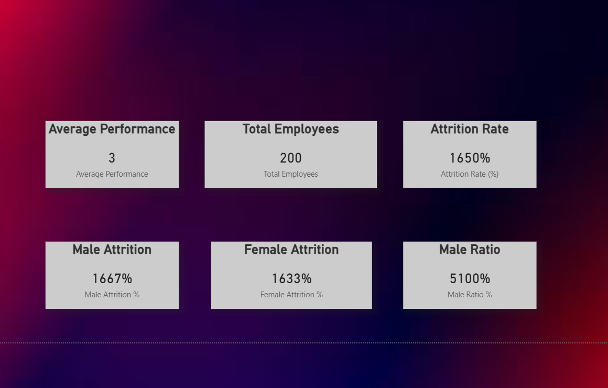

# Employee Performance Analysis Dashboard

## 📊 Project Overview
This project presents an **end-to-end Employee Performance Analysis** solution built using  
**Python, SQL, and Power BI**.

The objective of this project is to analyze employee performance, attrition patterns, and
key HR metrics to support data-driven decision-making.  
The solution covers the complete analytics lifecycle — from raw data processing to
interactive dashboard visualization.

---

## 🛠 Tools & Technologies
- **Power BI** – Data modeling, DAX measures, interactive dashboards
- **Python** – Data cleaning and preprocessing
- **SQL** – Aggregations and summary-level analysis
- **CSV** – Source and processed datasets

---

## 📂 Project Structure
Employee_Performance/
├── Data/
│ ├── Raw/ # Original datasets
│ └── Clean/ # Cleaned datasets after preprocessing
│
├── Python_analysis/
│ └── data_cleaning.py # Python script for data cleaning
│
├── SQL/
│ └── employee_summary.sql # SQL queries for analysis
│
├── PowerBI/
│ ├── Employee_performance.pbix
│ ├── dashboard_1.png
│ ├── dashboard_2.png
│ └── Employee_Performance_Report.pdf
│
└── README.md

---

## 📸 Dashboard Preview

Click the images to view them in full size:

  

---

## 📄 PDF Report
A detailed, presentation-ready report is available here:

👉 [Employee Performance Report (PDF)](PowerBI/Employee_Performance_Report.pdf)

---

## 🔍 Key Insights
- Gender-wise attrition comparison (Male vs Female)
- Department-level performance distribution
- Identification of high-risk attrition segments
- Performance trends based on experience and tenure
- KPI-driven summary for management-level decision-making

---

## ⚙️ Technical Highlights
- Designed a star-schema-based data model in Power BI
- Created custom **DAX measures** for:
  - Attrition rate
  - Gender ratio
  - Performance KPIs
- Performed data cleaning using Python:
  - Handling null values
  - Standardizing columns
  - Data validation
- Used SQL for summary tables and aggregations
- Implemented slicers and filters for interactive analysis

---

## 🚀 How to Use
1. Open `PowerBI/Employee_performance.pbix` in Power BI Desktop
2. Interact with slicers and visuals to explore insights
3. Refer to the PDF report for a static summary
4. Review Python and SQL scripts for data preparation logic

---

## 📈 Business Value
This dashboard helps HR and management teams:
- Monitor employee performance trends
- Identify attrition risks early
- Improve workforce planning
- Support strategic HR decisions with data

---

## 🔮 Future Enhancements
- Add predictive attrition modeling using Python
- Integrate live database connections
- Automate refresh using Power BI Service
- Add role-based dashboards for executives and HR teams

🔹 Next project (SQL-heavy or Python-heavy)

Just tell me what you want next, Dhana 💙
